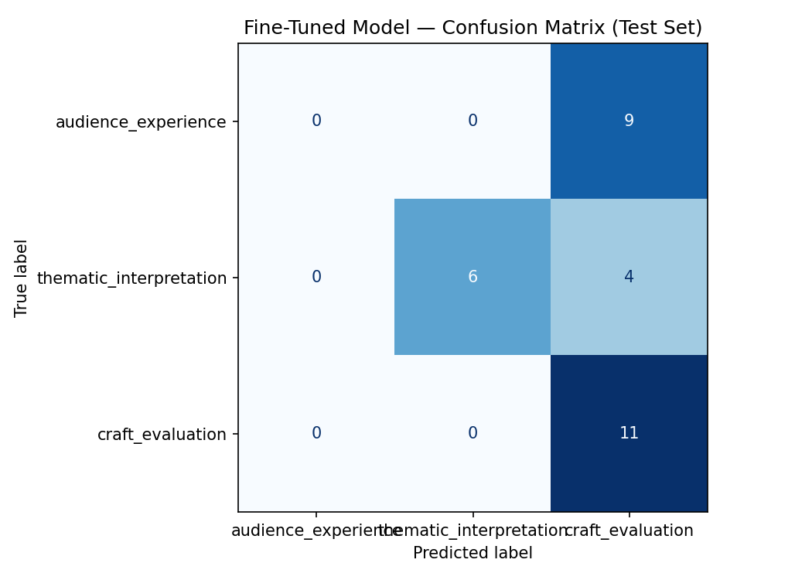

# Takemeter

This project focuses on film enthusiats dedicated to deep, text-heavy cinematic discourse that acts as an intellectual alternative to casual movie forums. The dataset classifies posts into three distinct labels: AUDIENCE_EXPERIENCE (personal emotions and viewing habits), THEMATIC_INTERPRETATION (decoding abstract meaning and subtext), and CRAFT_EVALUATION (analyzing technical execution and industry context). Separating these categories matters deeply to regulars because the community’s internal prestige is built entirely on moving past raw, consumer-level reactions and into rigorous textual or technical analysis.

## Community

We chose the broad community of **film enthusiasts**—cinephiles, academics, and dedicated hobbyists who gather online to have deep, analytical conversations about cinema. This community is a strong fit for classification precisely because that wide membership produces wildly varied discourse: a single discussion can swing from a gut-level emotional reaction, to a dense reading of a film's symbolism, to a technical critique of its editing or box-office strategy. That natural spread across personal, interpretive, and craft-focused registers is exactly what makes the labels meaningful, while the frequent hybrid takes that blend all three give the task genuine ambiguity worth resolving.

---

### Prompt Definitions (for the Groq baseline)

Compact, one-sentence definitions optimized for a zero-shot LLM prompt. These lead with concrete, observable cues and are tuned to match what each label actually looks like in our dataset (e.g., craft posts are dominated by acting/performance and career talk, not just camera work). The fuller definitions below are the human annotation guideline.

| Label | One-sentence definition | Example 1 | Example 2
| --- | --- | --- | --- |
| `CRAFT_EVALUATION` | Focuses on how a film or performance is executed or positioned: acting/performance, pacing, editing, cinematography, dialogue, plus a director's career, an actor's filmography, or box-office/industry context. | I watched 'Aftersun' last night and it completely broke me; I spent an hour staring at the ceiling thinking about my own dad and just couldn't shake the heavy feeling of grief. | Unpopular Opinion: I thought pulp fiction was a shit movie overall. I liked the dialogue and the most famous samuel l jackson scene. However I was pretty disappointed with the movie overall.
| `THEMATIC_INTERPRETATION` | Focuses on subtext and meaning: allegory, symbolism, political/social commentary, ideological messaging. | The recurring motif of water in 'Parasite' isn't just about the weather; it symbolizes the downward flow of systemic wealth and how capitalism inevitably drowns the lower class while barely splashing the rich.| So I ran into an article about the film Obsession and the headline immediately grabbed my attention: 'Obsession is the GET OUT for White people.' I just saw Obsession and outside of the dinner table scene, I don’t see the comparison.
| `AUDIENCE_EXPERIENCE` | Focuses on the viewer's internal state: emotional impact (laughter, fear, boredom), pacing frustration, personal viewing history, visceral reaction. | Generally, a script for any good film is very tight and cut to the bone. However, the cinematography and pacing are also crafted to help the viewer actually digest the beats and conversations in the movie. | My claim is that no actor in world cinema has a stronger run of consecutive films than Al Pacino between 1971 and 1975... with no weak link in between.

## Set-up
| Component | Tool | Notes
| --- | --- | --- |
|Base model	|distilbert-base-uncased|	HuggingFace — free to download, no account needed
|Fine-tuning |Google Colab (free GPU)|	Free T4 GPU; fine-tuning DistilBERT on 200 examples takes ~5–15 min
|Training libraries|	transformers + datasets + scikit-learn	| Pre-installed on Colab — no setup needed
|Baseline LLM|	Groq (llama-3.3-70b-versatile)	|Free tier — same account as Projects 1–2

**Hyperparameter decision** For the number of epochs, 3 was chosen because DistilBERT fine-tuning on small datasets tends to overfit quickly — more epochs would risk the model memorizing the training examples rather than generalizing. A learning rate of 2e-5 was kept at the standard recommended value for DistilBERT fine-tuning since it balances stable convergence without overshooting the pretrained weights.

---

## Data Collection

Data Sources
Posts and comments were collected manually from a mix of r/TrueFilm, r/movies, and various online movie review articles to gather a diverse range of film discourse.

Labeling Process
Each example was hand-copied into a CSV file. Labels were assigned based on the author's primary intent. For hybrid posts that blended multiple styles, the label was assigned based on the ultimate target of the post—whether the author was primarily trying to evaluate technical craft, decode meaning, or express a personal reaction. A strict labeling guide was used to resolve edge cases and keep categories consistent.

Label Distribution
craft_evaluation: 78 posts

thematic_interpretation: 66 posts

audience_experience: 56 posts

Total: 200 posts

---

## Baseline Description

The zero-shot baseline used Groq's llama-3.3-70b-versatile model with no task-specific training. Each test example was passed to the model with the following system prompt:

### Promt Used:
SYSTEM_PROMPT = 
"""You are classifying posts from a film enthusiast community dedicated to deep cinematic discourse.
Assign each post to exactly one of the following categories.

craft_evaluation: Focuses on how a film or performance is executed or positioned: acting/performance, pacing, editing, cinematography, dialogue, plus a director's career, an actor's filmography, or box-office/industry context.
Example: "My claim is that no actor in world cinema has a stronger run of consecutive films than Al Pacino between 1971 and 1975, with no weak link in between."

thematic_interpretation: Focuses on subtext and meaning: allegory, symbolism, political/social commentary, ideological messaging.
Example: "The recurring motif of water in Parasite isn't just about the weather; it symbolizes the downward flow of systemic wealth and how capitalism inevitably drowns the lower class while barely splashing the rich."

audience_experience: Focuses on the viewer's internal state: emotional impact (laughter, fear, boredom), pacing frustration, personal viewing history, visceral reaction.
Example: "I watched Aftersun last night and it completely broke me; I spent an hour staring at the ceiling thinking about my own dad and couldn't shake the heavy feeling of grief."

Respond with ONLY the label name.
Do not explain your reasoning.

Valid labels:
craft_evaluation
thematic_interpretation
audience_experience
"""

**How results were collected:**
The model was called with temperature=0 to ensure deterministic outputs and max_tokens=20 since only a single label name was expected. Requests were made sequentially with a 0.1 second delay between calls to respect free-tier rate limits. The model's raw output was lowercased and matched against the known label strings. Any response that did not match a valid label was marked as unparseable and excluded from accuracy calculations.

---
## Evaluation Report

🎯 **Baseline accuracy: 0.933** _(evaluated on 30/30 parseable responses)_

### Per-Class Metrics (Baseline)

| Class | Precision | Recall | F1-Score | Support |
| --- | --- | --- | --- | --- |
| `audience_experience` | 1.00 | 0.89 | 0.94 | 9 |
| `thematic_interpretation` | 1.00 | 0.90 | 0.95 | 10 |
| `craft_evaluation` | 0.85 | 1.00 | 0.92 | 11 |
| **Accuracy** | | | **0.93** | 30 |
| **Macro avg** | 0.95 | 0.93 | 0.94 | 30 |
| **Weighted avg** | 0.94 | 0.93 | 0.93 | 30 |

### Per-Class Metrics (Fine-Tuned Model)

🎯 **Fine-tuned model accuracy: 0.567**

| Class | Precision | Recall | F1-Score | Support |
| --- | --- | --- | --- | --- |
| `audience_experience` | 0.00 | 0.00 | 0.00 | 9 |
| `thematic_interpretation` | 1.00 | 0.60 | 0.75 | 10 |
| `craft_evaluation` | 0.46 | 1.00 | 0.63 | 11 |
| **Accuracy** | | | **0.57** | 30 |
| **Macro avg** | 0.49 | 0.53 | 0.46 | 30 |
| **Weighted avg** | 0.50 | 0.57 | 0.48 | 30 |

---

**Confusion Matrix**

---
## Reviewing Wrong Predictions
### Example 1
**Text:**  I've watched Into the Wild and Captain fantastic and they're both awesome movies. I spent the week after watching them rethinking all of my life's choices

**True:**    audience_experience

**Predicted:** craft_evaluation  (confidence: 0.35)

**Analysis:** The model is consistently confusing audience_experience with craft_evaluation because the fine-tuning process allowed it to learn a lazy shortcut based on the data distribution. Whenever specific movie titles or character names appear, the fine-tuned model automatically defaults to predicting a technical film review, completely failing to recognize when a post structurally shifts into a personal, real-world reaction. This is purely a data problem where the model has over-indexed on movie nouns rather than learning the actual boundary of human aftermath. To fix this mistake, the training dataset needs a tighter class definition and an injection of diverse "trick" examples that pair explicit movie names with purely personal, emotional consequences.

### Example 2
Text: It left me with mixed feelings: it felt a bit empty when I thought about it later; but then I found myself thinking about it a lot the rest of the year, so something must have clicked for me. It’s a unique film.

**True:**     audience_experience

**Predicted:** craft_evaluation  (confidence: 0.36)

**Analysis:** The model is confusing audience_experience with craft_evaluation here because it gets tripped up by high-level, evaluative summary words. When the text uses terms like "mixed feelings," "empty," and "unique film," the model incorrectly flags them as a technical critique of the movie's quality rather than an expression of personal, internal processing. This is a data boundary problem where the model fails to see that the core of the sentence is entirely about the timeline of the user's personal thoughts ("thinking about it a lot the rest of the year"). To fix this mistake, the fine-tuning data needs more examples in the audience_experience class that feature casual, high-level film summaries but focus heavily on the long-term emotional or mental aftermath of the viewing.

### Example 3
**Text:**      "I'd take Coppola's explanation of the ending as the only concrete theory -that it could be taken multiple ways. Either Caul was delusional, or the bug was hidden in the saxophone (this has always been my reading of the ending as well). On that note, the idea that the ending is uncertain is a very meaningful bookend to the whole point of the film. This movie came out only two years after the Watergate scandal, and the rapidly-evolving surveillance state/culture in America was yet mostly uncharted territory for social theorists, which made it perfect fodder for a director like Coppola. Based on how much cocaine the man was doing during the making of Apocalypse Now, I'd guess his main point in The Conversation has to do with the relationship between the state of surveillance technology and the political economy and systemic paranoia among the general public. The fact that the leading authority on surveillance tech (Caul) falls victim to such a deep state of paranoia that he destroys his entire apartment really drives that point home, and the mist of uncertainty that surrounds the ending gives the viewer a very similar feeling of unease.

**True:**      thematic_interpretation

**Predicted:** craft_evaluation  (confidence: 0.36)

**Analysis:** The model is confusing thematic_interpretation with craft_evaluation because it gets distracted by the mentions of behind-the-scenes production and filmmaking decisions. When the fine-tuned model sees markers like director names ("Coppola"), movie production trivia ("how much cocaine the man was doing during the making of Apocalypse Now"), and structural script talk ("meaningful bookend"), it automatically defaults to a technical film review. It completely misses the fact that the text uses those production notes purely as a bridge to analyze massive social and political themes like the "Watergate scandal," the "surveillance state," and "systemic paranoia." To fix this mistake, the fine-tuning data needs more examples where real-world history, director names, and production background are used specifically to build out a deep, thematic analysis.

## Sample Classifications

### **1.**

**Text:** Further to other comments, the white feather has also been used to symbolise cowardice and pacifism in many cultures. However, in the US it has been given to soldiers to symbolise instead bravery.

To tie to Forrest, he serves as a soldier in Vietnam. He is also brave in that war. During the course of the film, Forrest reflects right wing values more than left wing ones. Meanwhile Jenny more follows left wing values. They both go with the tide of the times but Forrest follows duty to achieve a freedom, Jenny follows personal liberty to achieve a freedom. They both seem to float like feathers on the wind but Forrest has a secret core, a railroad track of all American goodness that can be mistaken by others as lacking 'gump'tion.

**True:**     thematic_interpretation
**Predicted:** thematic_interpretation  (confidence: 0.37)

**Why it's reasonable:** This classification is reasonable because the text explicitly uses analytical frameworks—like mapping political ideologies onto the characters and decoding the cultural history of the feather—to uncover the deeper social message of the film rather than reviewing its technical production.

### **2.**
**Text:** Director Liza Johnson needs to be given a lot of credit, not only for her obvious rapport with actors (and skill in bringing the best out of them on camera - the whole cast is superb), but the balance and perspective she brings to the material. This film is a comedy (and an effective one) about what is, on its face, a truly absurd moment in history - yet she always maintains an essential affection for her characters and respect for their dignity, never stooping for cheap laughs or settling for oversimplification. Her timing is sharp, her staging direct and effective. In short, she does a damn good job and I'm interested in seeing more of her work.

**True:**      craft_evaluation
**Predicted:** craft_evaluation  (confidence: 0.39)

### **3.**
**Text:** Emily Blunt definitely has range but Sigourney was doing something completely different in her era. Like Ripley was this massive cultural shift - before Alien you didnt really see women carrying action films like that. Emily is great but shes working in landscape where strong female leads are already established you know

**True:**      craft_evaluation
**Predicted:** craft_evaluation  (confidence: 0.38)

--- 
## Reflection
The fine-tuned model completely missed the point of the labels and just looked for easy shortcuts in the text layout. We can prove this by looking at its $0.00$ F1-score for the audience_experience class, meaning it failed to correctly identify a single personal user story because it was obsessed with post length. It wrongly learned that long posts meant thematic analysis, while short posts meant a technical review. This layout bias caused the model to dump every short post into craft_evaluation, giving that class a $1.00$ recall score because it aggressively captured all short text regardless of what the words actually meant. The model never learned the true meaning of the labels; it just counted words and got tricked by movie names, tanking the overall accuracy from a $93.3\%$ baseline down to a broken $56.7\%$. To fix this, the next dataset needs short theme posts and long personal stories to force the model to read the actual words instead of just guessing based on the size of the text.

---

## Spec Reflection
**How the Specification Guided the Project**
The original specification was essential for structuring the core foundation of this project. It forced a strict upfront definition of the three target categories (craft_evaluation, thematic_interpretation, and audience_experience), which provided a vital roadmap when evaluating whether potential posts contained enough distinct signal to be included in the dataset.

**How the Implementation Diverged and Why**
While the spec provided a strong blueprint, real-world data collection required three major adjustments to maintain dataset quality:

**Source Platform Shift:** The spec originally targeted r/TrueFilm. However, implementation shifted to a mix of r/movies and professional review articles because r/TrueFilm comments were often too dense and deeply synthesized, making it incredibly difficult to find text blocks that cleanly mapped to only one single label.

**Text Length Reduction:** The spec originally planned for longer posts of up to 500 words. The final implementation restricted text sizes to a tighter range of 55–230 words to ensure each example remained highly focused on a single boundary without bleeding into multiple categories.

**Label Distribution Tweak:** The original target was a balanced split of 70, 65, and 65 examples. The final distribution shifted slightly to 78 craft_evaluation, 66 thematic_interpretation, and 56 audience_experience based on the strict availability of high-quality, single-intent texts.

--- 

## AI Tool Plan
I utilized an AI tool for dataset preparation, label verification, and failure analysis during this project.

Data Cleaning: I directed the AI to scan our dataset CSV to fix formatting errors, specifically correcting broken double-quotes within the text blocks.

Label Verification & Overrides: I used the AI to verify the accuracy of my final labels, ultimately overriding one of its suggestions where its reasoning failed to match our strict boundary definitions.

Failure Analysis: For the evaluation phase, I fed the list of incorrect predictions into the AI to help identify recurring error patterns. I then personally verified these patterns against the model's performance scores to ensure the layout and noun biases were mathematically true.
